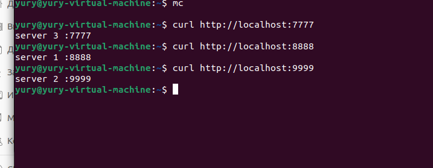
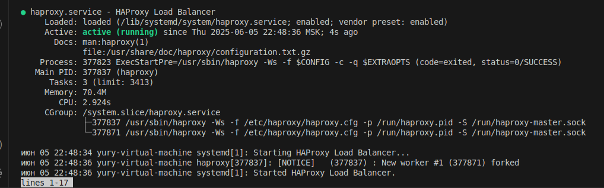

# Домашнее задание к занятию 2 «Кластеризация и балансировка нагрузки» Шелухин Юрий

### Задание 1
- Запустите два simple python сервера на своей виртуальной машине на разных портах
- Установите и настройте HAProxy, воспользуйтесь материалами к лекции по [ссылке](2/)
- Настройте балансировку Round-robin на 4 уровне.
- На проверку направьте конфигурационный файл haproxy, скриншоты, где видно перенаправление запросов на разные серверы при обращении к HAProxy.

---

# Решение 1.
1. Создадим два файла index.html в директориях http1 и http2. Укажем в них номера разные портов.      
    
   
запустим два simple python сервера  
python3 -m http.server 8888 --bind 0.0.0.0  и python3 -m http.server 9999 --bind 0.0.0.0  
   
проверим  

2. Установим HAProxy,
sudo apt install haproxy
Дополним файл конфигурации

(конфигурационный файл битый, при запуске дает ошибку.Исправил путем добавления строки внизу)
Перезапустим сервис

---

### Задание 2
- Запустите три simple python сервера на своей виртуальной машине на разных портах
- Настройте балансировку Weighted Round Robin на 7 уровне, чтобы первый сервер имел вес 2, второй - 3, а третий - 4
- HAproxy должен балансировать только тот http-трафик, который адресован домену example.local
- На проверку направьте конфигурационный файл haproxy, скриншоты, где видно перенаправление запросов на разные серверы при обращении к HAProxy c использованием домена example.local и без него.

---

# Решение 2.
1. Создадим еще файл index.html в директории http3.      
  
Запустим три simple python сервера, проверим  
python3 -m http.server 8888 (9999,7777) --bind 0.0.0.0  

2. Дополним файл конфигурации, перезагрузим сервис

3. Проверим направление запросов на разные серверы при обращении к HAProxy c использованием домена example.local и без него.

---

### Задание 3*
- Настройте связку HAProxy + Nginx как было показано на лекции.
- Настройте Nginx так, чтобы файлы .jpg выдавались самим Nginx (предварительно разместите несколько тестовых картинок в директории /var/www/), а остальные запросы переадресовывались на HAProxy, который в свою очередь переадресовывал их на два Simple Python server.
- На проверку направьте конфигурационные файлы nginx, HAProxy, скриншоты с запросами jpg картинок и других файлов на Simple Python Server, демонстрирующие корректную настройку.

---

# Решение 3*.
sudo apt install memcached  

---

### Задание 4*
- Запустите 4 simple python сервера на разных портах.
- Первые два сервера будут выдавать страницу index.html вашего сайта example1.local (в файле index.html напишите example1.local)
- Вторые два сервера будут выдавать страницу index.html вашего сайта example2.local (в файле index.html напишите example2.local)
- Настройте два бэкенда HAProxy
- Настройте фронтенд HAProxy так, чтобы в зависимости от запрашиваемого сайта example1.local или example2.local запросы перенаправлялись на разные бэкенды HAProxy
- На проверку направьте конфигурационный файл HAProxy, скриншоты, демонстрирующие запросы к разным фронтендам и ответам от разных бэкендов.

---

# Решение 4*.
sudo apt install memcached  

---

